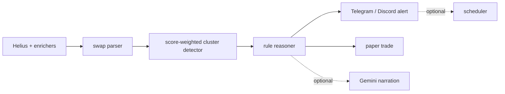

# wallet-cluster-detector

Catch Solana (and now Base) momentum before it trends. Detect when smart-money wallets cluster-buy the same token.


Single-wallet copy-trading is noisy. A cluster of scored wallets buying the same token inside a short window is a cleaner research signal. This repo is a framework, bring your own watchlist + thresholds.

## 30-second example

```python
from clusterdetect import ClusterDetector, ClusterScorer, TelegramAlerter

swaps = [
    {"signature": "s1", "wallet": "DemoA", "timestamp": 100, "side": "buy", "token_mint": "DemoMint", "usd_value": 40},
    {"signature": "s2", "wallet": "DemoB", "timestamp": 220, "side": "buy", "token_mint": "DemoMint", "usd_value": 55},
    {"signature": "s3", "wallet": "DemoC", "timestamp": 500, "side": "buy", "token_mint": "DemoMint", "usd_value": 25},
]

detector = ClusterDetector(min_wallets=3, window_minutes=15, min_total_score=6)
clusters = detector.detect(swaps, {"DemoA": 3, "DemoB": 2, "DemoC": 1})
review = ClusterScorer().evaluate(
    clusters[0],
    {"symbol": "DEMO", "liquidity_usd": 80000, "mcap": 900000},
    None,
    [{"address": w, "score": clusters[0].wallet_scores[w]} for w in clusters[0].wallets],
)
print(review.one_liner)
```

## Architecture



## What's included

- Helius client with rate-limit, circuit breaker, multi-key rotation, daily budget, signature-first polling, and redacted logs.
- Swap parser for Helius enhanced SWAP transactions, including raw amount formats and inner swap fallback.
- Score-weighted sliding-window cluster detector.
- Keyless **Base / EVM read adapter**: reconstructs swaps from on-chain ERC-20 transfers, normalized to the same swap shape, so detection runs on Base via `scan --chain base`.
- Inbound **webhook receiver**: accepts a signature-verified Helius-style swap payload for lower-latency cluster capture, no extra polling credits.
- Rule-based signal reasoner with STRONG / OK / RISKY / SKIP outputs.
- DexScreener, GeckoTerminal, Rugcheck, and Pump.fun enrichers. All are free public sources.
- Optional Pump.fun graduation gate for graduated or near-graduation launch clusters.
- Winner-discovery watchlist builder: reverse-engineer early buyers from recent winners instead of buying a list.
- Telegram or Discord alerts, optional Gemini commentary, scheduler snippets, SQLite persistence, cluster export, rank leaderboard, and a parameterized paper-trade simulator.

## Helius free-tier survival

Helius free credits are monthly, not daily. This client rotates keys on the `"max usage reached"` response, opens a 24h circuit when all keys are exhausted, and keeps a local credit counter so loops stop before they become abusive. See [docs/helius_setup.md](docs/helius_setup.md).


## Build your own watchlist

The detector ships dummy wallets only. Use [examples/winner_discovery](examples/winner_discovery/) or paste your own scored list. This is a framework, bring your own watchlist + thresholds.


## Install

PyPI publish is pending. Until the first PyPI release, install from GitHub:

```bash
pip install git+https://github.com/baronguyen001/wallet-cluster-detector.git
clusterdetect init-db
clusterdetect doctor
clusterdetect discover 20 --dry
clusterdetect scan --graduated-only
clusterdetect export --format csv --out clusters.csv
clusterdetect rank
```

## Alerts and filters

Use Telegram, Discord, or both:

```yaml
alert:
  channel: both
  webhook_url: https://discord.com/api/webhooks/WEBHOOK_ID/WEBHOOK_TOKEN
```

Set `DISCORD_WEBHOOK_URL` in `.env` for Discord. To only surface clusters whose target token is already graduated or near graduation on Pump.fun, set:

```yaml
filters:
  pumpfun_graduation: true
```

Or run one scan with `clusterdetect scan --graduated-only`.

## Export and leaderboard

Export detected clusters from SQLite for review:

```bash
clusterdetect export --format json --out clusters.json
clusterdetect export --format csv --out clusters.csv
clusterdetect rank --limit 20
```

The export includes token mint, wallet count, public wallet-score total, tier flag, timestamp, and total cluster buy value.

## Report and graph (read-only)

Two read-only views of clusters that are *already* detected — they format what is
in the database and collect nothing new:

```bash
# A single self-contained HTML summary page (no JS, no network)
clusterdetect report --out clusters_report.html

# A wallet/token graph for Gephi / Cytoscape / networkx
clusterdetect graph --format graphml --out clusters.graphml
clusterdetect graph --format dot --out clusters.dot
clusterdetect graph --format json
```

In the graph a wallet that shows up across several clusters becomes one shared
node, which is exactly what makes coordinated buying easy to see.

## Performance and calibration (offline)

Two offline views over data that is already on disk — no network, no new collection:

```bash
# Quality metrics for the closed paper trades: win rate, expectancy, profit factor,
# max drawdown, streaks, hold time, and a per-exit-reason breakdown.
clusterdetect stats
clusterdetect stats 30 --format markdown

# What-if grid: re-run the detector over stored swaps for every threshold combination,
# so min-wallets / window / score come from data instead of a guess.
clusterdetect calibrate 30 --min-wallets 2,3,4 --window 5,15,30 --score 4,6,9
clusterdetect calibrate --format json
```

`pnl` answers "what did each day look like", `stats` answers "what does the distribution
look like", and `calibrate` answers "which thresholds would have been worth using".
Both new commands take `--format text|json|markdown`.

## Base / EVM (opt-in)

The detector started Solana-only. v0.3.0 adds a keyless **Base** read adapter that reconstructs swaps from on-chain ERC-20 `Transfer` logs and normalizes them into the same swap shape, so the existing cluster detector runs on Base unchanged. The default Solana path is untouched.

```bash
# Offline demo (no RPC, no keys):
python examples/base_adapter/run_base.py

# Live: add wallets with chain=base to your watchlist, then opt in:
clusterdetect scan --chain base
```

It reads the free public Base RPC (`https://mainnet.base.org`) by default. Bring your own endpoint via `EVM_RPC_URL` for higher rate limits. See [examples/base_adapter](examples/base_adapter/).

## Webhook receiver (lower latency)

Instead of polling Helius, run an inbound **webhook receiver** that ingests pushed swaps the moment they land and feeds them into the same pipeline. It is HMAC-SHA256 signature-verified (bring your own `WEBHOOK_SECRET`, constant-time check, no default secret) and never trades.

```bash
# Offline demo (no socket, no keys):
python examples/webhook/post_swap.py

# Live receiver — point your Helius webhook here:
WEBHOOK_SECRET=your-shared-secret clusterdetect webhook --host 127.0.0.1 --port 8787
```

Every request must carry `X-Webhook-Signature: sha256=<hmac>`. See [examples/webhook](examples/webhook/).

For development:

```bash
pip install -e ".[dev,viz]"
pytest -q
```

## Comparison

| Tool | Focus | This repo differs by |
| --- | --- | --- |
| Birdeye / Solscan tracker | Inspect token or wallet manually | Programmable cluster detection and paper trading |
| Cielo Finance | Wallet alerts | Open, local, bring-your-own scoring |
| Paid wallet lists | Static source of wallets | Winner-discovery builds your own list from recent public winners |

## Trawlkit case study

This is one application of the `scrape -> score -> AI -> alert -> schedule` pattern used by [Trawlkit](https://github.com/baronguyen001/Trawlkit). For free automation learning material, see [ai-automation-skills](https://github.com/baronguyen001/ai-automation-skills).

-> Build the full bot with [Trawlkit](https://github.com/baronguyen001/Trawlkit).

## Disclaimer

Research and education only. This is not financial advice. You bring your own API keys, wallet list, thresholds, execution rules, and risk management.
