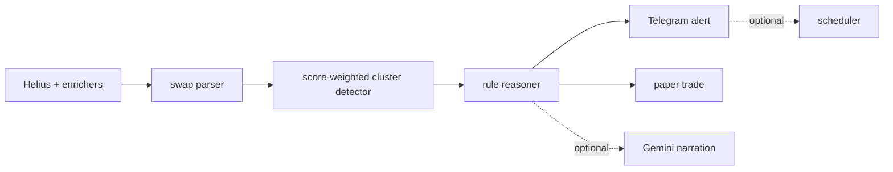

# wallet-cluster-detector

Catch Solana momentum before it trends. Detect when smart-money wallets cluster-buy the same token.


Single-wallet copy-trading is noisy. A cluster of scored wallets buying the same token inside a short window is a cleaner research signal. This repo is a framework, bring your own watchlist + thresholds.

## 30-second example

```python
from clusterdetect import ClusterDetector, ClusterScorer, TelegramAlerter

swaps = [
    {"signature": "s1", "wallet": "DemoA", "timestamp": 100, "side": "buy", "token_mint": "DemoMint", "usd_value": 40},
    {"signature": "s2", "wallet": "DemoB", "timestamp": 220, "side": "buy", "token_mint": "DemoMint", "usd_value": 55},
    {"signature": "s3", "wallet": "DemoC", "timestamp": 500, "side": "buy", "token_mint": "DemoMint", "usd_value": 25},
]

detector = ClusterDetector(min_wallets=3, window_minutes=15, min_total_score=6)
clusters = detector.detect(swaps, {"DemoA": 3, "DemoB": 2, "DemoC": 1})
review = ClusterScorer().evaluate(
    clusters[0],
    {"symbol": "DEMO", "liquidity_usd": 80000, "mcap": 900000},
    None,
    [{"address": w, "score": clusters[0].wallet_scores[w]} for w in clusters[0].wallets],
)
print(review.one_liner)
```

## Architecture



## What's included

- Helius client with rate-limit, circuit breaker, multi-key rotation, daily budget, signature-first polling, and redacted logs.
- Swap parser for Helius enhanced SWAP transactions, including raw amount formats and inner swap fallback.
- Score-weighted sliding-window cluster detector.
- Rule-based signal reasoner with STRONG / OK / RISKY / SKIP outputs.
- DexScreener, GeckoTerminal, Rugcheck, and Pump.fun enrichers. All are free public sources.
- Winner-discovery watchlist builder: reverse-engineer early buyers from recent winners instead of buying a list.
- Telegram alerts, optional Gemini commentary, scheduler snippets, SQLite persistence, and a parameterized paper-trade simulator.

## Helius free-tier survival

Helius free credits are monthly, not daily. This client rotates keys on the `"max usage reached"` response, opens a 24h circuit when all keys are exhausted, and keeps a local credit counter so loops stop before they become abusive. See [docs/helius_setup.md](docs/helius_setup.md).


## Build your own watchlist

The detector ships dummy wallets only. Use [examples/winner_discovery](examples/winner_discovery/) or paste your own scored list. This is a framework, bring your own watchlist + thresholds.


## Install

```bash
pip install wallet-cluster-detector
clusterdetect init-db
clusterdetect doctor
clusterdetect discover 20 --dry
```

For development:

```bash
pip install -e ".[dev,viz]"
pytest -q
```

## Comparison

| Tool | Focus | This repo differs by |
| --- | --- | --- |
| Birdeye / Solscan tracker | Inspect token or wallet manually | Programmable cluster detection and paper trading |
| Cielo Finance | Wallet alerts | Open, local, bring-your-own scoring |
| Paid wallet lists | Static source of wallets | Winner-discovery builds your own list from recent public winners |

## Trawlkit case study

This is one application of the `scrape -> score -> AI -> alert -> schedule` pattern used by [Trawlkit](https://github.com/barobaonguyen/Trawlkit). For free automation learning material, see [ai-automation-skills](https://github.com/barobaonguyen/ai-automation-skills).

## Disclaimer

Research and education only. This is not financial advice. You bring your own API keys, wallet list, thresholds, execution rules, and risk management.
